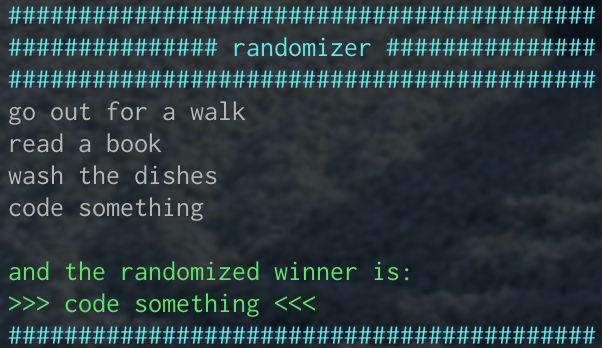

# randomizer

This is a script to generate a random response of some requests. 

## Problem
Do you know this: sometimes I don't know what to do next.  
So i scripted a small randomizer, which is telling me what to do next ;) 

## Solution
Screenshot macOS: 

 

## Usage
#### randomizer.sh
Just type in your "requests" (at the end of each line press enter). 
If you are done, let one line empty and press again enter. 

## Contribution
You are welcome to contribute this project! Please follow the standard rules. 
If you find a bug or have any other tools to display, then please firstly open an issue. 
If you are creating a Pull Request, please update the version & date of last change in the script - and use [SemVer](http://semver.org). 
Also please take care to indent with 2 spaces. 
Thank you. 

## Copyright and License
Copyright :copyright: 2018 Michael Wellner ([@m1well](http://www.twitter.m1well.de)) 
Code released under the [MIT License](/LICENSE). 
